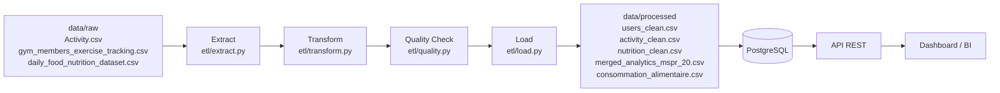
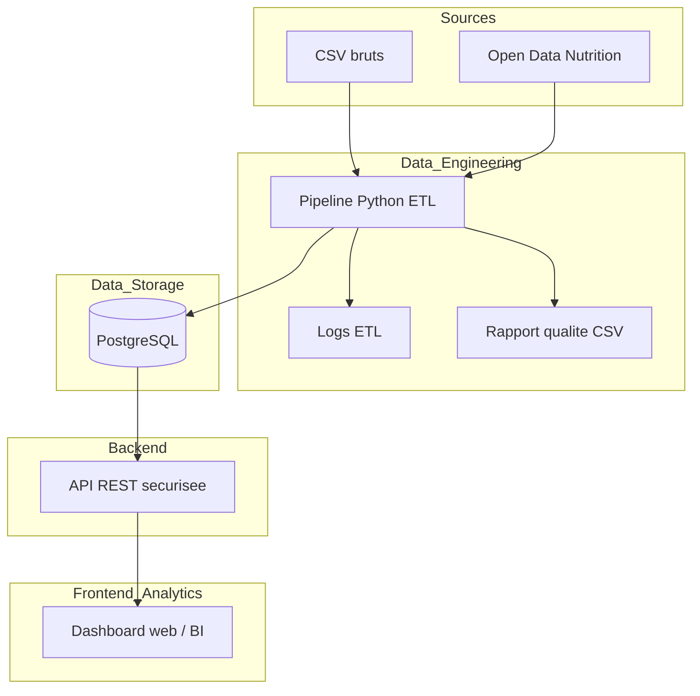
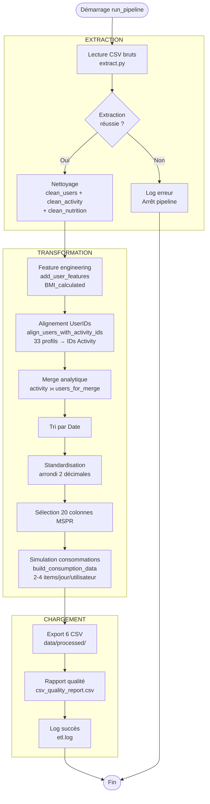
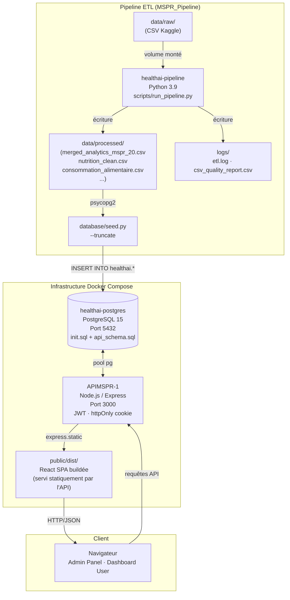
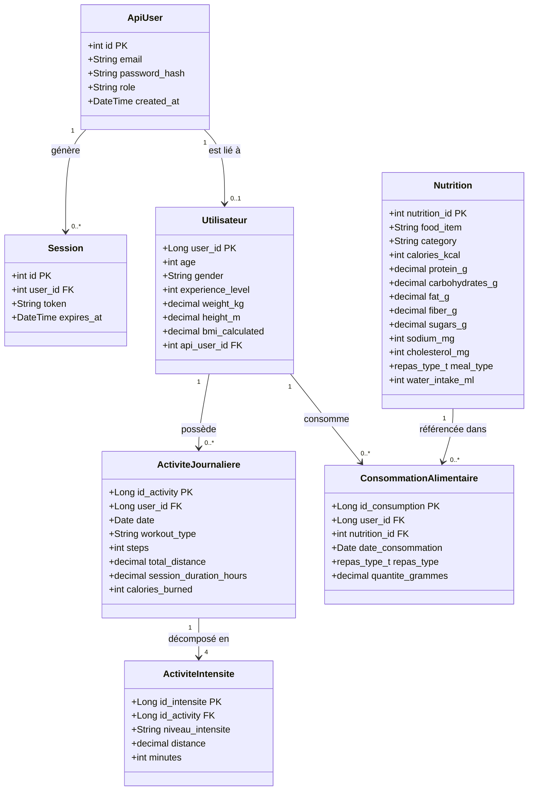
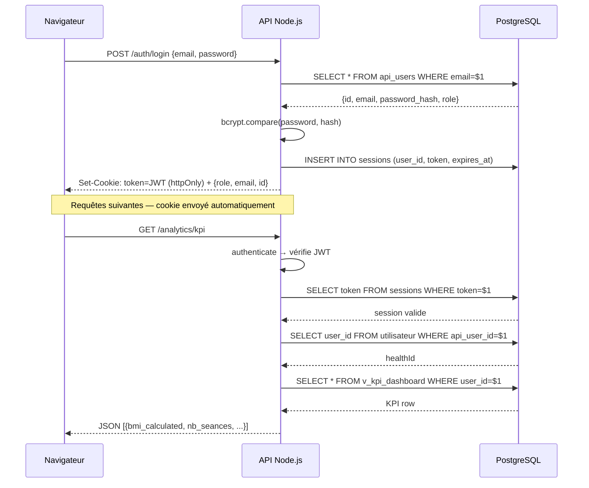
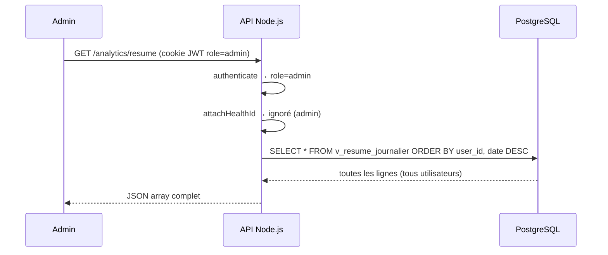

# Diagrammes MSPR

Ce document contient l'ensemble des diagrammes du projet HealthAI Coach :

1. Diagramme de flux de données (DFD)
2. Diagramme d'architecture technique
3. Diagramme d'activité — exécution du pipeline ETL
4. Diagramme de déploiement (Docker / infrastructure)
5. Diagrammes UML (classes + séquence)

---

## 1) Diagramme de flux de donnees (DFD)



---

## 2) Diagramme d'architecture technique



---

## 3) Diagramme d'activité — exécution du pipeline ETL

Ce diagramme détaille le déroulement séquentiel du pipeline avec les points de décision et de contrôle qualité.



---

## 4) Diagramme de déploiement

Vue de l'infrastructure complète du projet HealthAI Coach.



**Note :** L'interface React (`client/src`) doit être compilée (`npm run build`) avant déploiement. Elle est ensuite servie par l'API Node.js depuis `public/dist/`.

---

## 5) UML

### 5.1 Diagramme de classes (modèle complet)



### 5.2 Diagramme de séquence — authentification JWT



### 5.3 Diagramme de séquence — requête analytics (admin)



### 5.4 Diagramme des vues analytiques

```mermaid
flowchart LR
    subgraph Tables["Tables source"]
        U[(utilisateur)]
        AJ[(activite_journaliere)]
        AI[(activite_intensite)]
        N[(nutrition)]
        CA[(consommation_alimentaire)]
    end

    subgraph Vues["Vues PostgreSQL (healthai.*)"]
        V1[v_profil_utilisateur]
        V2[v_resume_journalier]
        V3[v_bilan_calorique]
        V4[v_apport_nutritionnel]
        V5[v_intensite_seance]
        V6[v_kpi_dashboard]
    end

    subgraph Endpoints["GET /analytics/*"]
        E1[/profil]
        E2[/resume]
        E3[/bilan]
        E4[/apport]
        E5[/intensite]
        E6[/kpi]
    end

    U --> V1
    U & AJ --> V2
    U & AJ & N & CA --> V2
    V2 --> V3
    CA & N --> V4
    AJ & AI --> V5
    V1 & V2 --> V6

    V1 --> E1
    V2 --> E2
    V3 --> E3
    V4 --> E4
    V5 --> E5
    V6 --> E6
```

